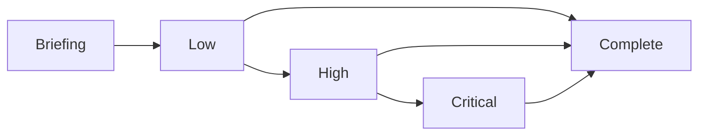
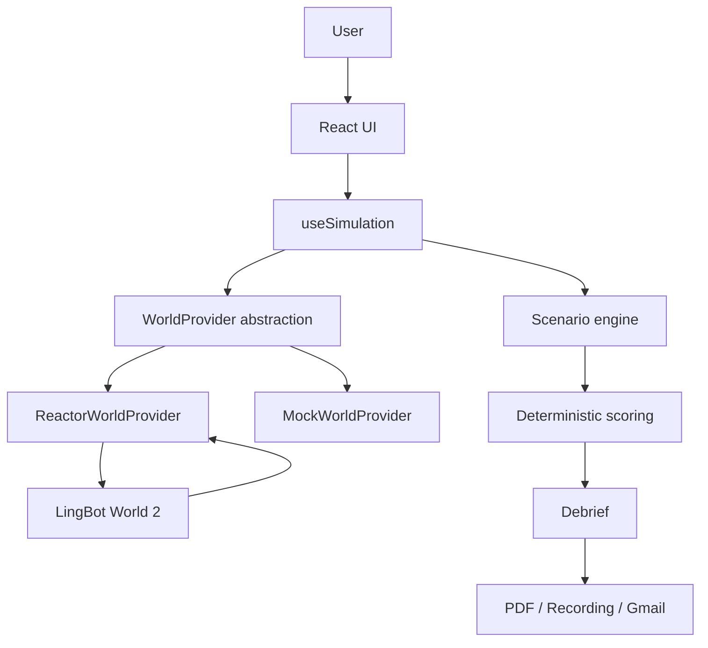

# Criscris

**Interactive emergency-response training powered by a real-time world model**

Built by **Kaushik Yellanki**

- Live Demo: https://criscris-inception.vercel.app
- GitHub Repository: https://github.com/YellankiKaushik/Criscris-Inception
- Accelerated scenario timing: https://criscris-inception.vercel.app/?demo=1

`?demo=1` only shortens the scenario timing for demos. It does not switch the app
from the Live Reactor World to the Demo World. World selection is controlled by
`VITE_WORLD_PROVIDER`, and the in-app fallback can switch a failed live session
to the deterministic Demo World.

## One-Minute Overview

Traditional emergency training tells people what to do. Criscris places the
trainee inside an evolving emergency and makes them decide.

Criscris is a browser-based interactive emergency-response simulation. The
current prototype is **Warehouse Fire - Simulation 01**, where the user enters
an industrial warehouse environment, navigates with keyboard controls, watches
conditions deteriorate, makes emergency decisions, and completes the run by
evacuating or timing out.

After the run, Criscris produces a deterministic performance assessment with a
100-point score, category breakdown, positives, improvement areas, response
timeline, downloadable PDF report, optional live-world recording, and a Gmail
supervisor compose flow.

In Live Reactor mode, Reactor is the world environment itself. It is not
generating a decorative background video. Criscris sends a warehouse seed image,
scenario prompts, movement commands, and look commands to LingBot World 2, then
renders the returned `main_video` stream as the active simulation world.

## Problem Statement

Most workplace safety training is passive:

- Videos are predetermined.
- Slide decks do not create spatial pressure.
- Multiple-choice quizzes do not create real-time decisions.
- Users are rarely forced to act while conditions deteriorate.
- Trainers need evidence of what was decided and when.

Criscris does not replace professional emergency-response training, workplace
safety certification, or site-specific procedures. It is a prototype for
interactive scenario practice and evidence-backed assessment.

## Solution

Criscris turns the training session into a complete loop:

```text
Briefing
  -> live world preparation
  -> navigation
  -> escalating emergency
  -> decisions
  -> evacuation or timeout
  -> score
  -> debrief
  -> evidence export
```

The user is not simply shown an emergency. They move through the world, make
decisions at specific times, and receive a deterministic assessment based on
those choices.

## Who Criscris Is For

Criscris is a prototype for:

- Emergency-response trainers
- Industrial safety teams
- Workplace training programs
- Simulation researchers
- World-model developers
- Organizations exploring interactive scenario training

It does not claim existing customers or production deployment inside any safety
organization.

## Why Criscris Uses a World Model

A traditional training video is pre-rendered and non-interactive. A conventional
static simulation is usually pre-authored around fixed environments and limited
interaction paths.

Criscris uses Reactor so the world can be prepared as an interactive generated
environment that responds to navigation commands and scenario prompts.

**Reactor is not generating a background video. Reactor is the simulation
environment.**

In Live Reactor mode, Criscris uses `@reactor-models/lingbot-world-2`. LingBot
World 2 receives:

- The warehouse seed image from `public/warehouse-seed.jpg`
- The initial scenario prompt
- Continuous movement and look commands
- Updated hazard prompts when the emergency reaches HIGH and CRITICAL stages

It returns:

- A live `main_video` `MediaStream` rendered in the browser viewport

## Key Features

### Live Reactor World

Live mode uses `@reactor-models/lingbot-world-2` through
`src/lib/world/reactorWorldProvider.ts`.

Implemented lifecycle details:

- Server-scoped authentication through `/api/reactor-token`
- Temporary JWT minting from the server-only `REACTOR_API_KEY`
- LingBot World 2 model instance creation in the browser
- Event listeners attached before connection
- Capacity-aware connection retries
- Warehouse seed upload
- Scenario prompt preparation
- `conditions_ready` wait before the world is considered ready
- `start()` request
- `generation_started` wait
- `main_video` readiness wait before the scenario timer begins

### Interactive Navigation

Keyboard input is handled in `src/hooks/useSimulation.ts` and forwarded through
the `WorldProvider` interface.

| Key         | Action        |
| ----------- | ------------- |
| W           | Move forward  |
| S           | Move backward |
| A           | Strafe left   |
| D           | Strafe right  |
| Arrow Left  | Look left     |
| Arrow Right | Look right    |
| Arrow Up    | Look up       |
| Arrow Down  | Look down     |

Keys are held for continuous movement. Releasing a key returns that motion axis
to `idle`; window blur also resets all motion commands to `idle`.

### Dynamic Emergency Escalation

The scenario moves through LOW, HIGH, and CRITICAL hazard stages.

Normal timing:

| Stage event |        Time |
| ----------- | ----------: |
| HIGH        |  35 seconds |
| CRITICAL    |  75 seconds |
| Timeout     | 150 seconds |

Accelerated timing with `?demo=1`:

| Stage event |       Time |
| ----------- | ---------: |
| HIGH        | 15 seconds |
| CRITICAL    | 35 seconds |
| Timeout     | 75 seconds |

`?demo=1` does not mean Demo World. It only selects
`demoScenarioConfig` in `src/lib/scenario/config.ts`.

### Emergency Decisions

The implemented decision buttons are:

| Button               | Stored action type     | Meaning                                            |
| -------------------- | ---------------------- | -------------------------------------------------- |
| REPORT EMERGENCY     | `report_emergency`     | Radio the emergency to the site fire response team |
| SEARCH FOR WORKERS   | `search_workers`       | Sweep nearby aisles for remaining personnel        |
| ATTEMPT FIRE CONTROL | `attempt_fire_control` | Attempt direct suppression with on-site equipment  |
| EVACUATE             | `evacuate`             | Leave the building via the nearest safe exit       |

Each action records:

- Action type
- Elapsed time in seconds
- Scenario stage when the action was taken

Non-evacuation actions can be used once. Evacuation completes the simulation.

### Performance Scoring

Criscris scores five categories, 0-20 points each, for a total of 100:

- Situational Awareness
- Emergency Reporting
- Risk Assessment
- Response Time
- Evacuation Decision

The scoring model is deterministic and implemented in
`src/lib/scenario/scoring.ts`.

### Debrief

The debrief shows:

- Overall score
- Score band
- Outcome
- Response time
- Completion timestamp
- Category breakdown
- Positive actions
- Improvement areas
- Action timeline

Score bands:

| Total score | Band               |
| ----------: | ------------------ |
|      85-100 | Strong Response    |
|       70-84 | Effective Response |
|       50-69 | Needs Improvement  |
|        0-49 | High-Risk Response |

### PDF Assessment

The PDF report is generated client-side by
`src/lib/export/simulationEvidence.ts`. It includes scenario name, date/time,
outcome, score, risk classification, response time, category scores, positives,
improvements, action timeline, and a prototype safety disclaimer.

The filename format is:

```text
criscris-warehouse-fire-YYYY-MM-DD-HHMMSS-report.pdf
```

### Live Simulation Recording

When a live `MediaStream` is available, Criscris records it with the browser
`MediaRecorder` API. Supported MIME candidates are tried in this order:

- `video/webm;codecs=vp9`
- `video/webm;codecs=vp8`
- `video/webm`

The filename format is:

```text
criscris-warehouse-fire-YYYY-MM-DD-HHMMSS-recording.webm
```

Demo World recording is unavailable by design because the mock provider does
not produce a live `MediaStream`.

### Gmail Supervisor Flow

The debrief includes a supervisor email input. When the email is valid, Criscris
opens Gmail Web Compose with:

- Supervisor recipient
- Structured subject
- Score summary
- Risk classification
- Category scores
- Positives
- Improvement areas

Browser compose URLs cannot attach local Blob files automatically. The
downloaded PDF and video recording must be attached manually.

### Retry Live World

If a Reactor session cannot start, Criscris can retry the live world. The retry
path replaces the provider/session, clears stale recording state, creates a
fresh Reactor attempt, and uses the same live-stream readiness checks before the
timer begins.

The Reactor provider also includes bounded retries for capacity errors and
clear user-facing messages for capacity, authentication, network, timeout,
quota, and video-stream readiness failures.

### Demo World

Demo World is the deterministic local fallback implemented by
`src/lib/world/mockWorldProviders.ts` and rendered through
`src/components/crisis/WorldViewport.tsx`.

Demo World provides:

- Local warehouse visualization from the seed image
- Interactive camera-style movement
- Hazard-driven visual escalation
- The same scenario decision buttons
- The same scoring and debrief logic
- PDF report and Gmail compose flow

Demo World does not call Reactor and is not an AI-generated live world.

## Live Reactor World vs Demo World

| Capability                   | Live Reactor World                                              | Demo World                                     |
| ---------------------------- | --------------------------------------------------------------- | ---------------------------------------------- |
| World source                 | LingBot World 2 session                                         | Local deterministic mock provider              |
| Navigation                   | Commands sent to Reactor model                                  | Camera-style local viewport movement           |
| AI-generated environment     | Yes                                                             | No                                             |
| Hazard progression           | LOW/HIGH/CRITICAL prompts sent to active session                | Local visual overlays and same scenario stages |
| Decision system              | Same Criscris actions                                           | Same Criscris actions                          |
| Scoring                      | Same deterministic scoring                                      | Same deterministic scoring                     |
| PDF report                   | Available                                                       | Available                                      |
| Video recording              | Available when `main_video` stream records successfully         | Unavailable by design                          |
| Internet requirement         | Required for Reactor token and world session                    | Not required after app loads                   |
| External capacity dependency | Depends on Reactor availability, capacity, credits, and network | No Reactor dependency                          |

## User Flow

1. Open Criscris.
2. Read the scenario briefing.
3. Start the simulation.
4. Criscris prepares the selected world provider.
5. In Live Reactor mode, Criscris waits for `main_video`.
6. The timer begins only after the world is live-ready.
7. Navigate with W/A/S/D and arrow keys.
8. Watch the emergency escalate from LOW to HIGH to CRITICAL.
9. Make emergency decisions.
10. Evacuate or reach the timeout.
11. Review the debrief.
12. Download the PDF report and, if available, the live-world recording.
13. Open the Gmail supervisor compose flow if needed.
14. Restart the simulation.

Failure path:

```text
Live Reactor unavailable
  -> Retry Live World
  -> or Switch to Demo Mode
```

## Controls

| Control     | Function     |
| ----------- | ------------ |
| W           | Forward      |
| S           | Backward     |
| A           | Strafe left  |
| D           | Strafe right |
| Arrow Left  | Look left    |
| Arrow Right | Look right   |
| Arrow Up    | Look up      |
| Arrow Down  | Look down    |

Live Reactor mode forwards these commands to LingBot World 2. Demo World uses
the same motion state to shift, zoom, and tilt the local warehouse viewport.

## Scenario State Machine



The implemented stages are:

- `briefing`: scenario setup before the run begins
- `low`: initial smoke and assessment window
- `high`: conditions deteriorate and evacuation planning becomes urgent
- `critical`: immediate evacuation is recommended
- `complete`: the run ended through evacuation or timeout

Completion occurs when the user selects EVACUATE or when the hard-stop timer is
reached.

## Reactor World Lifecycle

The working Live Reactor lifecycle is:

```text
Browser
  -> POST /api/reactor-token
  -> server reads REACTOR_API_KEY
  -> server mints temporary scoped JWT
  -> LingBot World 2 model instance created
  -> media/event listeners attached
  -> connect(jwt)
  -> warehouse seed uploaded
  -> image + prompt configured
  -> conditions_ready
  -> start
  -> generation_started
  -> main_video MediaStream
  -> scenario timer begins
```

The timer does not begin merely because `start()` was requested. In
`ReactorWorldProvider.start()`, Criscris waits for `generation_started` and for
the `main_video` stream to become available. Only after `provider.start()`
resolves does `useSimulation` dispatch `started` and set the simulation start
timestamp.

## Reactor Authentication & Security

`REACTOR_API_KEY` is server-only and is read in
`src/lib/reactor/mintToken.ts`. The browser never receives the permanent
Reactor API key.

The `/api/reactor-token` route mints a temporary session JWT through
`https://api.reactor.inc/tokens`. The token request is scoped to:

```text
reactor/lingbot-world-2
```

The token constraints include:

```text
max_sessions: 4
```

Only the temporary JWT is returned to the browser.

## Runtime Resilience

Criscris includes user-facing resilience for live-world startup:

- Bounded capacity retries during Reactor connection
- Clear errors for missing key, auth failure, rate limits, service downtime,
  timeout, network failure, malformed token responses, and token mint failure
- Retry Live World action
- Switch to Demo Mode action
- Main-video readiness timeout
- Stream-ended failure detection
- Provider/session replacement on retry and fallback
- Stale listener/session cleanup in provider disposal and reset paths

## Technical Architecture

Criscris separates the simulation into UI, scenario state, world providers,
scoring, and evidence export.



Primary files:

- `src/routes/index.tsx` selects briefing, live simulation, or debrief view.
- `src/hooks/useSimulation.ts` owns simulation lifecycle and provider
  coordination.
- `src/lib/world/types.ts` defines the shared `WorldProvider` contract.
- `src/lib/world/reactorWorldProvider.ts` adapts LingBot World 2.
- `src/lib/world/mockWorldProviders.ts` implements the Demo World fallback.
- `src/lib/scenario/scoring.ts` calculates deterministic performance scores.
- `src/lib/export/simulationEvidence.ts` generates evidence artifacts.

## Application Architecture

| Module                 | Responsibility                                                                  |
| ---------------------- | ------------------------------------------------------------------------------- |
| `ScenarioBriefing`     | Landing page, scenario briefing, start CTA, live retry/fallback actions         |
| `SimulationShell`      | Runtime layout, timer, hazard indicator, world status, viewport, decision panel |
| `WorldViewport`        | Live Reactor video rendering or local Demo World visualization                  |
| `DecisionPanel`        | Objective text and four emergency action buttons                                |
| `DebriefView`          | Score, band, outcome, categories, timeline, PDF, recording, Gmail, restart      |
| `useSimulation`        | State machine, timer, keyboard input, recording lifecycle, provider replacement |
| `WorldProvider`        | Provider interface for live and mock worlds                                     |
| `ReactorWorldProvider` | LingBot World 2 connection, prompts, commands, stream readiness, cleanup        |
| `MockWorldProvider`    | Deterministic local provider with motion state and no external dependency       |

The implementation deliberately separates:

- World generation
- Scenario state
- Scoring
- Evidence/export

That separation lets the Demo World and Live Reactor World share the same
scenario, decisions, scoring, and debrief.

## Codebase Walkthrough

```text
.
|-- public/
|   |-- warehouse-seed.jpg
|   |-- favicon.ico
|   `-- robots.txt
|-- src/
|   |-- components/
|   |   |-- crisis/
|   |   |   |-- ScenarioBriefing.tsx
|   |   |   |-- SimulationShell.tsx
|   |   |   |-- WorldViewport.tsx
|   |   |   |-- DecisionPanel.tsx
|   |   |   `-- DebriefView.tsx
|   |   `-- ui/
|   |-- hooks/
|   |   `-- useSimulation.ts
|   |-- lib/
|   |   |-- export/
|   |   |   `-- simulationEvidence.ts
|   |   |-- reactor/
|   |   |   |-- fetchClientToken.ts
|   |   |   |-- mintToken.ts
|   |   |   `-- tokenErrors.ts
|   |   |-- scenario/
|   |   |   |-- config.ts
|   |   |   |-- prompts.ts
|   |   |   |-- scoring.ts
|   |   |   `-- types.ts
|   |   `-- world/
|   |       |-- index.ts
|   |       |-- types.ts
|   |       |-- mockWorldProviders.ts
|   |       `-- reactorWorldProvider.ts
|   |-- routes/
|   |   |-- api/
|   |   |   `-- reactor-token.ts
|   |   |-- __root.tsx
|   |   `-- index.tsx
|   |-- server.ts
|   |-- start.ts
|   `-- styles.css
|-- package.json
|-- vite.config.ts
`-- .env.example
```

Important files:

| File                                    | Purpose                                                   |
| --------------------------------------- | --------------------------------------------------------- |
| `src/lib/scenario/config.ts`            | Normal and accelerated scenario timing                    |
| `src/lib/scenario/prompts.ts`           | LOW, HIGH, and CRITICAL world prompts plus objective text |
| `src/lib/scenario/types.ts`             | Scenario, hazard, action, state, and world status types   |
| `src/lib/scenario/scoring.ts`           | Deterministic 100-point scoring model                     |
| `src/lib/world/index.ts`                | Provider selection from `VITE_WORLD_PROVIDER`             |
| `src/lib/world/types.ts`                | Live/mock provider interface                              |
| `src/lib/world/mockWorldProviders.ts`   | Local deterministic Demo World provider                   |
| `src/lib/world/reactorWorldProvider.ts` | LingBot World 2 live-world adapter                        |
| `src/lib/reactor/fetchClientToken.ts`   | Browser-side token request helper                         |
| `src/lib/reactor/mintToken.ts`          | Server-side Reactor JWT minting                           |
| `src/lib/reactor/tokenErrors.ts`        | Safe token error messages                                 |
| `src/lib/export/simulationEvidence.ts`  | PDF, filenames, Blob downloads, Gmail body                |
| `src/routes/api/reactor-token.ts`       | Server route for temporary Reactor JWTs                   |

## Technology Stack

| Layer         | Technology                             | Role                                                |
| ------------- | -------------------------------------- | --------------------------------------------------- |
| Language      | TypeScript                             | Application and domain types                        |
| UI            | React 19                               | Component rendering                                 |
| Framework     | TanStack Start                         | App shell, SSR-capable routes, server route support |
| Routing       | TanStack Router                        | File-based route definitions                        |
| Build         | Vite                                   | Development and production build                    |
| Styling       | Tailwind CSS 4                         | Utility styling and design tokens                   |
| UI primitives | Radix UI packages                      | Reusable accessible components                      |
| Icons         | lucide-react                           | Icon library available to the app                   |
| World model   | `@reactor-models/lingbot-world-2`      | Live generated world session                        |
| Video stream  | `MediaStream`                          | Reactor `main_video` rendering                      |
| Recording     | Browser `MediaRecorder`                | Live-world recording                                |
| PDF           | Custom client-side PDF Blob generation | Simulation assessment report                        |
| Hosting       | Vercel                                 | Live deployment target                              |

## Scoring Model

The scoring model is deterministic and totals 100 points.

### Situational Awareness - 20 points

- +10 if SEARCH FOR WORKERS happens before CRITICAL.
- +10 if REPORT EMERGENCY happens before CRITICAL.
- Improvement is shown if the worker search is missing or delayed until
  CRITICAL.

### Emergency Reporting - 20 points

- 20 points if REPORT EMERGENCY happens at or before 45 seconds.
- 15 points if it happens at or before 75 seconds.
- 8 points if it happens after 75 seconds.
- 0 points if the emergency is never reported.

### Risk Assessment - 20 points

The category starts at 20.

- No ATTEMPT FIRE CONTROL: remains 20 and counts as avoiding unnecessary direct
  engagement.
- ATTEMPT FIRE CONTROL during LOW: -3 points.
- ATTEMPT FIRE CONTROL during HIGH: -8 points.
- ATTEMPT FIRE CONTROL during CRITICAL: -15 points.

The result is clamped between 0 and 20.

### Response Time - 20 points

- 20 points if EVACUATE happens at or before 90 seconds.
- 15 points if it happens at or before 120 seconds.
- 8 points if it happens at or before 150 seconds.
- 0 points if evacuation never happens.

### Evacuation Decision - 20 points

- 20 points for evacuating during HIGH.
- 15 points for evacuating during CRITICAL.
- 12 points for evacuating during LOW.
- 0 points if evacuation never happens.

This is a prototype heuristic scoring model. It is not a formal safety
certification or workplace-safety assessment.

## Simulation Evidence

Criscris produces three evidence paths after completion.

| Evidence   | Current behavior                                         |
| ---------- | -------------------------------------------------------- |
| PDF report | Downloads a generated PDF assessment                     |
| Recording  | Downloads the recorded live `MediaStream` when available |
| Gmail      | Opens Gmail Web Compose with structured report text      |

The Gmail flow does not automatically attach the report or recording. The email
body tells the trainee to attach the downloaded files manually.

## Running Locally

Install dependencies:

```sh
npm install
```

Start development:

```sh
npm run dev
```

Run lint:

```sh
npm run lint
```

Build production output:

```sh
npm run build
```

Additional available scripts:

```sh
npm run build:dev
npm run preview
npm run format
```

## Environment Variables

`.env.example`:

```env
# Server-only. Never prefix with VITE_. Never commit real values.
REACTOR_API_KEY=

# Public client config. Allowed: mock | reactor
VITE_WORLD_PROVIDER=mock
```

| Variable              | Scope                | Purpose                                                    |
| --------------------- | -------------------- | ---------------------------------------------------------- |
| `REACTOR_API_KEY`     | Server only          | Permanent Reactor API key used only to mint temporary JWTs |
| `VITE_WORLD_PROVIDER` | Public client config | Selects `mock` or `reactor` provider                       |

Valid `VITE_WORLD_PROVIDER` values:

- `mock`: use Demo World
- `reactor`: use Live Reactor World

Any value other than `reactor` resolves to `mock`.

Never expose the permanent Reactor key in a `VITE_` variable.

## Deployment

The live app is deployed at:

```text
https://criscris-inception.vercel.app
```

Live Reactor mode requires a server-capable deployment because the app needs
`/api/reactor-token` to mint temporary Reactor JWTs without exposing
`REACTOR_API_KEY` to the browser.

Production deployment should configure:

```env
REACTOR_API_KEY=<server-side secret>
VITE_WORLD_PROVIDER=reactor
```

Demo-only deployment can run with:

```env
VITE_WORLD_PROVIDER=mock
```

## Current Prototype Limitations

- One scenario is implemented: Warehouse Fire - Simulation 01.
- Scoring is heuristic and deterministic, not a certified safety assessment.
- Criscris is not a replacement for professional safety certification.
- Live Reactor mode depends on service availability, capacity, credits, and
  network conditions.
- Demo World is a deterministic fallback, not a live generated world.
- There are no accounts, database, or long-term simulation history.
- Browser recording depends on a live `MediaStream` and `MediaRecorder`
  support.
- Gmail compose cannot automatically attach locally generated Blob files.

## Hackathon

Criscris was built for the **Inception II World Models Hackathon** in the
**Robotics** track.

## Author

**Kaushik Yellanki**

GitHub: https://github.com/YellankiKaushik
