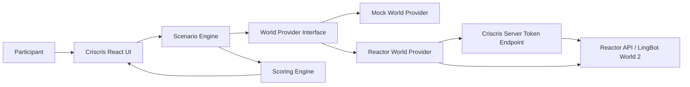
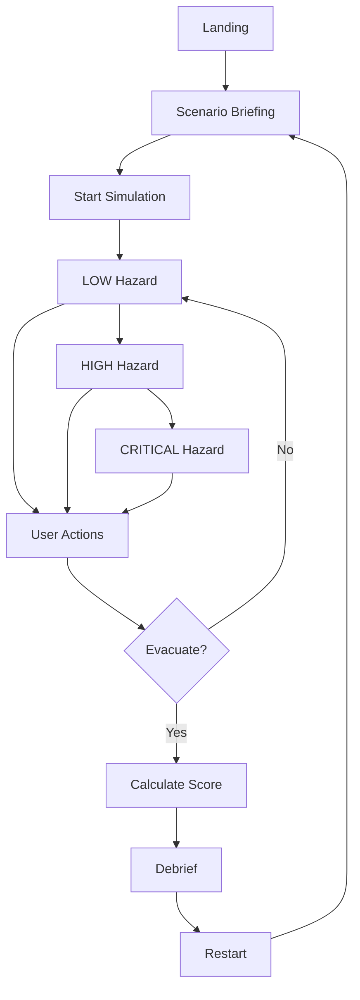
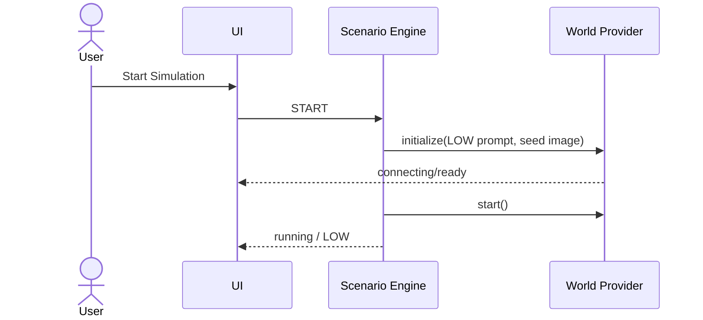
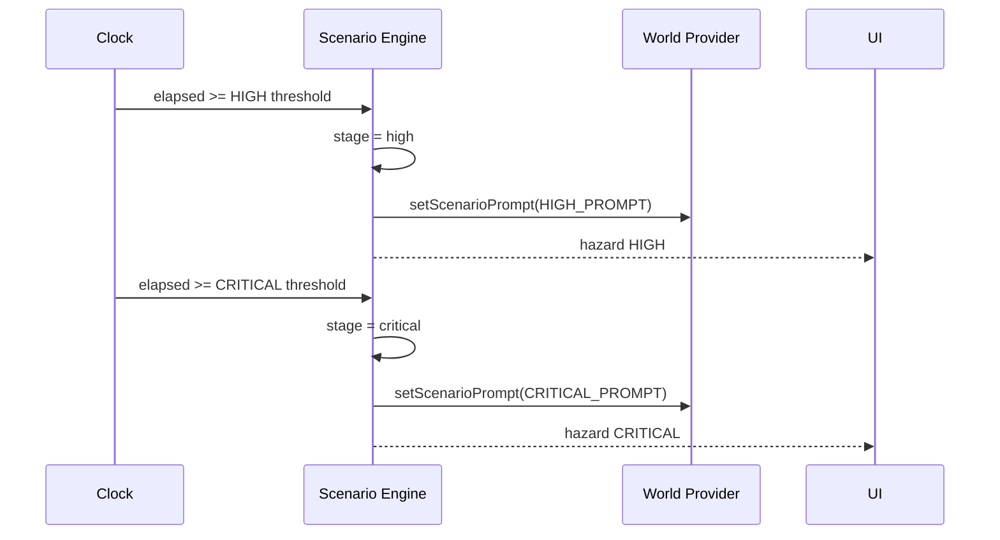
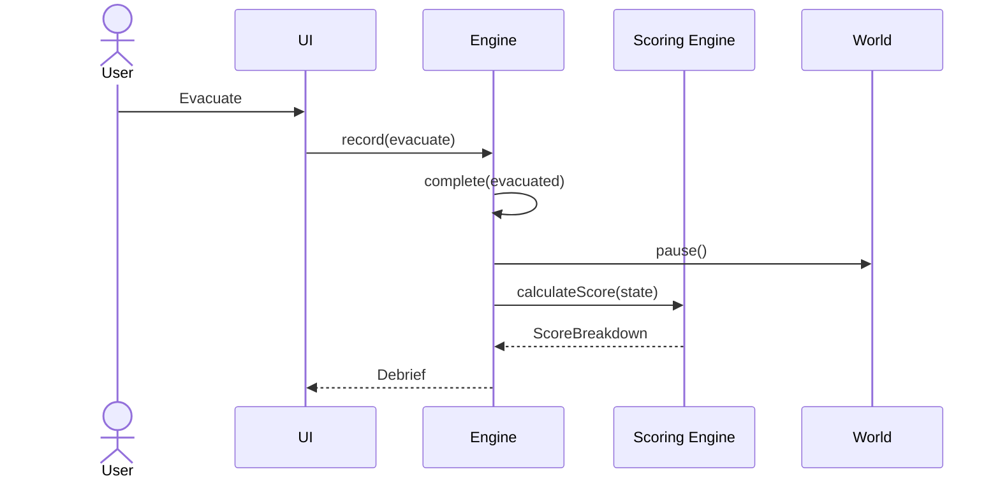

# Criscris — Deep Technical Architecture & Lovable Build Specification

> **Document type:** Master Technical Architecture / Engineering Design / AI Builder Execution Specification  
> **Documentation model:** Docs-as-Code, implementation-first  
> **Recommended filename:** `CRISCRIS_DEEP_TECHNICAL_ARCHITECTURE.md`  
> **Status:** Active — Hackathon Build Specification  
> **System:** Criscris  
> **Project:** Criscris — Inception II World Model Hackathon  
> **Track:** Robotics / Simulation & Embodied AI  
> **Repository:** `YellankiKaushik/Criscris-Inception` (existing repository; Lovable cannot import it directly)  
> **Document version:** 1.0  
> **System version:** Hackathon MVP  
> **Last updated:** 2026-08-22  
> **Primary owner:** Kaushik Yellanki  
> **Technical owner:** Kaushik Yellanki  
> **Security owner:** Kaushik Yellanki  
> **Operations owner:** Kaushik Yellanki  
> **Implementation target:** Lovable first, GitHub sync/export second, Codex/Reactor integration and hardening third  
> **Submission operating deadline:** 2026-08-23 17:00 IST; target completed submission before 16:15 IST

---

# 0. Lovable Execution Directive — Read This First

This document is the authoritative build specification for **Criscris**.

Lovable MUST treat the requirements below as implementation instructions, not as loose brainstorming.

## 0.1 Primary build objective

Build a complete, polished, responsive web application for an interactive emergency-response simulation named **Criscris**.

The hackathon MVP contains exactly **one scenario**:

> **Industrial warehouse fire / evacuation simulation**

The user must be able to:

1. understand the scenario;
2. start a simulation;
3. view a world viewport;
4. navigate the world when the real Reactor provider is enabled;
5. observe the emergency progress through LOW, HIGH, and CRITICAL stages;
6. take four explicit emergency-response actions;
7. evacuate;
8. receive a deterministic score out of 100;
9. receive a structured debrief;
10. restart the simulation.

## 0.2 Critical implementation rule: mock-first

Lovable MUST implement a **fully usable mock world provider first**.

The entire product flow MUST work without Reactor credentials.

The application architecture MUST support two providers:

```text
mock
reactor
```

The mock provider is the default during initial Lovable generation.

The real Reactor provider is an adapter that can be implemented or completed after the Lovable-generated product is exported/synced to GitHub and opened in Codex.

The product MUST NOT be blocked by missing Reactor credentials.

## 0.3 Do not build these features

Lovable MUST NOT add any of the following unless explicitly requested later:

- authentication;
- sign-up or login;
- Supabase;
- database persistence;
- user profiles;
- admin dashboard;
- payments;
- multiplayer;
- chat;
- social features;
- mobile native application;
- Python backend;
- LangChain;
- CrewAI;
- AutoGen;
- autonomous multi-agent architecture;
- multiple emergency scenarios;
- enterprise analytics;
- certification workflows;
- complex role management;
- real emergency-procedure certification;
- browser exposure of `REACTOR_API_KEY`;
- browser exposure of any provider secret.

## 0.4 Framework rule

Use the **current default Lovable web stack** generated for a new project.

As of the date of this specification, new Lovable applications use a React + TypeScript stack with TanStack Start/SSR as the default for new apps. Do not migrate the generated project to Next.js merely for this hackathon.

Use:

- TypeScript in strict mode;
- React;
- the framework/router generated by Lovable;
- Tailwind CSS;
- shadcn/ui where it materially speeds implementation;
- framework-native server-side functionality for the Reactor token endpoint;
- no database.

If Lovable generates a slightly different supported project layout, preserve that layout and implement the logical modules described in this document.

## 0.5 Quality rule

The application MUST remain buildable at every phase.

Do not create speculative files that import packages not installed.

Do not leave TypeScript errors.

Do not use `any` unless unavoidable in a third-party adapter boundary; prefer `unknown` and type narrowing.

---

# 1. Executive Technical Overview

## 1.1 System summary

Criscris is a browser-based prototype for **interactive emergency-response decision training**. Instead of presenting a user with a static document, quiz, or prerecorded training video, Criscris places the user inside an evolving visual environment and requires decisions while the emergency changes.

The hackathon MVP simulates a warehouse fire. A participant receives a briefing, enters a generated or mocked first-person warehouse environment, watches the hazard level escalate, and decides whether to report the emergency, search for workers, attempt fire control, or evacuate.

The primary world-model integration is Reactor's **LingBot World 2**. The real provider uses a reference image and natural-language scene prompt to generate a continuous navigable video stream. User keyboard input maps to the model's movement/look commands. Scenario-stage changes map to live prompt changes so the generated environment can visually deteriorate as the exercise progresses.

Criscris owns the simulation state machine, timer, objectives, decision capture, deterministic scoring, debrief UI, errors, and fallback behavior. Reactor owns generation of the interactive visual world when the Reactor provider is enabled.

For hackathon reliability, the system is intentionally designed with a `WorldProvider` abstraction. `MockWorldProvider` allows the entire application to function without external AI services. `ReactorWorldProvider` replaces the mock viewport with the real world-model stream without changing scenario or scoring code.

No application database is required. Simulation state exists only for the current browser session. Refreshing or restarting the simulation resets state.

The permanent Reactor API key is a server-only secret. A server endpoint exchanges the permanent key for a short-lived Reactor JWT. The browser receives only the short-lived model-scoped token.

Deployment must support server-side execution because the Reactor token exchange cannot safely be performed in static browser code. Lovable Cloud is acceptable if the server endpoint and server secrets are supported. A Node-compatible external deployment is the fallback.

## 1.2 One-minute architecture



## 1.3 Architecture at a glance

| Dimension                       | Implementation                                                                    |
| ------------------------------- | --------------------------------------------------------------------------------- |
| Architecture style              | Small modular web application with provider/adapter boundary                      |
| Primary language                | TypeScript                                                                        |
| Frontend                        | React using Lovable's generated current stack                                     |
| Styling                         | Tailwind CSS; shadcn/ui allowed                                                   |
| Server                          | Framework-native server endpoint for Reactor JWT minting                          |
| Database                        | N/A — no persistence required                                                     |
| Cache                           | N/A                                                                               |
| Messaging                       | N/A                                                                               |
| World model                     | Reactor LingBot World 2                                                           |
| Default development provider    | MockWorldProvider                                                                 |
| Authentication                  | N/A for end users                                                                 |
| External-service authentication | Server-held Reactor API key -> short-lived JWT                                    |
| Deployment                      | Lovable Cloud preferred if server route supported; otherwise Node-compatible host |
| Repository flow                 | Lovable-generated repo -> GitHub -> Codex -> final deployment                     |
| Testing                         | Unit tests for scenario/scoring + manual end-to-end demo test                     |

---

# 2. Problem, Goals, Scope, and Constraints

## 2.1 Problem statement

Traditional emergency training is often passive: users read instructions, watch videos, and answer quizzes. That format does not reproduce uncertainty, time pressure, spatial navigation, deteriorating visibility, or evolving conditions.

Criscris demonstrates a different training primitive: an interactive generated environment that changes while the user is inside it.

The MVP is a **hackathon prototype**, not a certified safety-training system.

## 2.2 Product goals

| ID     | Goal                                     | Success metric                                                |
| ------ | ---------------------------------------- | ------------------------------------------------------------- |
| BG-001 | Demonstrate meaningful world-model usage | Reactor world is central to the live demo                     |
| BG-002 | Deliver a complete end-to-end experience | Start -> simulation -> decisions -> evacuation -> score works |
| BG-003 | Be understandable in under 10 seconds    | Landing/briefing clearly states what Criscris does            |
| BG-004 | Be judge-demo friendly                   | Core flow can be demonstrated in ~60–120 seconds              |
| BG-005 | Remain usable under provider failure     | Mock fallback can still demonstrate product UX                |

## 2.3 Technical goals

| ID     | Goal                            | Measurement                                             |
| ------ | ------------------------------- | ------------------------------------------------------- |
| TG-001 | Type-safe frontend              | TypeScript build completes without errors               |
| TG-002 | Provider isolation              | Scenario code does not import Reactor SDK directly      |
| TG-003 | Secure Reactor authentication   | Permanent Reactor API key never shipped to browser      |
| TG-004 | Deterministic scoring           | Same action timeline produces same score                |
| TG-005 | Reliable restart                | Restart clears simulation state and returns to briefing |
| TG-006 | External dependency degradation | Reactor failure presents controlled fallback/error UI   |
| TG-007 | Fast hackathon iteration        | Mock mode requires no API key or external service       |

## 2.4 Non-goals

Criscris MVP does NOT attempt to:

- certify emergency responders;
- model fire physics accurately;
- teach official firefighting procedures;
- provide medical advice;
- simulate multiple disaster types;
- create intelligent NPC crowds;
- provide enterprise employee management;
- persist user history;
- provide analytics across participants;
- function as a production safety system.

## 2.5 In scope

- one warehouse-fire scenario;
- briefing screen;
- real-time simulation HUD;
- world viewport;
- mock world provider;
- Reactor world provider interface;
- Reactor LingBot World 2 integration contract;
- three hazard stages;
- four decision actions;
- timer;
- action timeline;
- deterministic score;
- debrief;
- restart;
- graceful provider failure;
- responsive desktop-first UI;
- GitHub-ready codebase.

## 2.6 Out of scope

- authentication;
- database;
- Supabase;
- user accounts;
- Python;
- multi-agent frameworks;
- multiplayer;
- mobile-native app;
- additional emergency scenarios;
- official safety certification;
- payment/subscription;
- admin tools.

## 2.7 Constraints

### Hackathon constraints

- Very short implementation window.
- Submission target is before 2026-08-23 17:00 IST.
- External credits are limited.
- Demo reliability is more important than broad feature count.
- The core world-model integration must be demonstrable.

### Technical constraints

- `REACTOR_API_KEY` must remain server-side.
- Reactor real mode requires network connectivity.
- LingBot World 2 requires both a seed image and prompt before generation starts.
- Reactor setter commands take effect asynchronously at chunk boundaries.
- Reactor movement states persist until explicitly returned to `idle`.
- No database should be introduced.

---

# 3. Users and Primary User Journey

## 3.1 Primary actor

**Actor:** Hackathon judge / participant / evaluator  
**Type:** Human  
**Authentication:** None

## 3.2 Primary journey



## 3.3 User-facing narrative

The user should feel that they are entering a live training exercise.

Suggested briefing copy:

> **Warehouse Fire — Simulation 01**  
> Smoke has been reported in Sector B of an industrial warehouse. Assess the situation, make response decisions, and evacuate when you determine conditions are unsafe. Your timing and decisions will be evaluated at the end.

The product must clearly label itself as a **prototype simulation**.

---

# 4. Functional Requirements Baseline

## 4.1 Core functional requirements

| ID     | Requirement              |         Priority | Acceptance criteria                                         |
| ------ | ------------------------ | ---------------: | ----------------------------------------------------------- |
| FR-001 | Landing/briefing         |               P0 | User understands scenario and can start                     |
| FR-002 | Simulation state machine |               P0 | LOW -> HIGH -> CRITICAL transitions occur                   |
| FR-003 | Timer                    |               P0 | Elapsed time updates while simulation active                |
| FR-004 | World viewport           |               P0 | Mock world renders; Reactor provider can replace it         |
| FR-005 | Report action            |               P0 | One-time action is recorded with timestamp/stage            |
| FR-006 | Search action            |               P0 | One-time action is recorded with timestamp/stage            |
| FR-007 | Fire-control action      |               P0 | One-time action is recorded with timestamp/stage            |
| FR-008 | Evacuate action          |               P0 | Ends simulation and triggers scoring                        |
| FR-009 | Deterministic scoring    |               P0 | Score 0–100 and category scores are generated               |
| FR-010 | Debrief                  |               P0 | User sees category score, positives, improvements           |
| FR-011 | Restart                  |               P0 | All state resets safely                                     |
| FR-012 | Provider abstraction     |               P0 | Mock and Reactor implement same logical interface           |
| FR-013 | Reactor token endpoint   | P0 for real mode | Browser can request scoped short-lived token                |
| FR-014 | Reactor initialization   | P0 for real mode | Connect -> upload image -> set image -> set prompt -> start |
| FR-015 | Reactor video rendering  | P0 for real mode | `main_video` renders in viewport                            |
| FR-016 | Reactor navigation       | P0 for real mode | Keyboard maps to movement/look methods                      |
| FR-017 | Live prompt update       | P0 for real mode | HIGH/CRITICAL stages call `setPrompt`                       |
| FR-018 | Error state              |               P0 | User receives clear failure UI, no blank screen             |
| FR-019 | Demo/mock fallback       |               P1 | Failed real provider can return to demo mode                |
| FR-020 | Optional AI debrief      |               P2 | Only if core app is complete                                |
| FR-021 | Optional Fish Audio      |               P2 | Only if core app is complete                                |

## 4.2 Non-functional requirements

### NFR-SEC-001 — Secret isolation

`REACTOR_API_KEY` must never be included in client-side code, `VITE_*` environment variables, logs, documentation, GitHub, browser storage, or network responses.

### NFR-MNT-001 — Module boundaries

Scenario logic, scoring, UI, and world-provider implementation must be separate modules.

### NFR-UX-001 — Demo clarity

A first-time user must understand the objective without reading external instructions.

### NFR-RES-001 — Graceful degradation

External-service failure must produce a visible recoverable state.

### NFR-PERF-001 — UI responsiveness

Local UI interactions such as decision buttons and timers should feel immediate and must not wait for Reactor acknowledgement unless the operation itself requires it.

### NFR-A11Y-001 — Accessibility

Buttons must have accessible labels, focus states, sufficient contrast, and keyboard usability.

---

# 5. Experience and UI Specification

## 5.1 Visual direction

Criscris should feel like a **serious emergency operations interface**, not a consumer SaaS dashboard.

Design characteristics:

- dark neutral base;
- high-contrast typography;
- restrained emergency red/amber accents;
- large world viewport;
- small amount of chrome;
- strong status hierarchy;
- monospaced or technical-style secondary labels allowed;
- no excessive gradients;
- no glassmorphism overload;
- no decorative dashboard charts;
- no stock corporate illustrations.

The world viewport is the hero of the product.

## 5.2 Required screens

### Screen A — Landing / scenario briefing

Required elements:

- Criscris wordmark/title;
- one-line product explanation;
- scenario card: `Warehouse Fire — Simulation 01`;
- 3 short briefing bullets;
- label: `Prototype training simulation`;
- primary CTA: `Start Simulation`;
- small `How scoring works` disclosure;
- provider indicator only in development/debug UI, not prominent in judge demo.

### Screen B — Simulation

Desktop layout:

```text
┌──────────────────────────────────────────────────────────────┐
│ CRISCRIS      01:04      HAZARD: HIGH      WORLD: CONNECTED │
├──────────────────────────────────────────────────────────────┤
│                                                              │
│                                                              │
│                     WORLD VIEWPORT                           │
│                                                              │
│                                                              │
├──────────────────────────────────────────────────────────────┤
│ OBJECTIVE                                                    │
│ Conditions are deteriorating. Determine a safe response.    │
│                                                              │
│ [REPORT] [SEARCH] [CONTROL FIRE] [EVACUATE]                 │
└──────────────────────────────────────────────────────────────┘
```

Required HUD:

- elapsed time;
- hazard badge;
- objective text;
- provider/world connection status;
- action controls;
- optional compact event log;
- keyboard-control hint.

### Screen C — Debrief

Required:

- overall score;
- score classification;
- five category scores;
- timeline of actions;
- `What you did well`;
- `What to improve`;
- response time;
- restart button.

## 5.3 Responsive behavior

Primary target: laptop/desktop hackathon judging.

On narrow screens:

- stack HUD sections;
- maintain world viewport at useful aspect ratio;
- decision buttons become a 2x2 grid or vertical list;
- never hide `Evacuate`.

---

# 6. Scenario Domain Model

## 6.1 Scenario stages

```ts
export type ScenarioStage = "briefing" | "low" | "high" | "critical" | "complete";
```

`complete` is entered immediately when the player evacuates or the scenario hard timeout is reached.

## 6.2 Hazard levels

```ts
export type HazardLevel = "LOW" | "HIGH" | "CRITICAL";
```

## 6.3 Timing

Recommended MVP timeline:

| Elapsed time | Stage                                      | Hazard   |
| -----------: | ------------------------------------------ | -------- |
|       0–34 s | low                                        | LOW      |
|      35–74 s | high                                       | HIGH     |
|  75 s onward | critical                                   | CRITICAL |
|        150 s | forced completion/failure if not evacuated | CRITICAL |

The user may evacuate at any point.

Timers should be constants in one configuration module so they can be shortened for demo recording without rewriting logic.

Suggested config:

```ts
export const scenarioConfig = {
  highAtSeconds: 35,
  criticalAtSeconds: 75,
  hardStopSeconds: 150,
} as const;
```

For a faster judge demo, allow a development/demo configuration such as:

```ts
export const demoScenarioConfig = {
  highAtSeconds: 15,
  criticalAtSeconds: 35,
  hardStopSeconds: 75,
} as const;
```

Do not expose a confusing settings panel to normal users. A query parameter or build-time flag is sufficient if needed.

## 6.4 Player actions

```ts
export type PlayerActionType =
  "report_emergency" | "search_workers" | "attempt_fire_control" | "evacuate";
```

```ts
export interface PlayerAction {
  id: string;
  type: PlayerActionType;
  timestampSeconds: number;
  stage: ScenarioStage;
}
```

Business rules:

- `report_emergency` can be recorded once;
- `search_workers` can be recorded once;
- `attempt_fire_control` can be recorded once;
- `evacuate` immediately ends the active scenario;
- action buttons should visually show completed/used state;
- no action is persisted after restart.

## 6.5 Simulation state

```ts
export interface SimulationState {
  status: "idle" | "starting" | "running" | "complete" | "error";
  stage: ScenarioStage;
  hazardLevel: HazardLevel;
  elapsedSeconds: number;
  actions: PlayerAction[];
  startedAt: number | null;
  completedAt: number | null;
  completionReason: "evacuated" | "timeout" | null;
  worldStatus: WorldStatus;
  worldError: string | null;
}
```

Use `useReducer` or an equivalent explicit reducer/state machine rather than many unrelated `useState` calls.

---

# 7. Scenario Prompts

The prompt constants must live in a dedicated module.

## 7.1 LOW prompt

```text
A realistic first-person industrial warehouse used for an
emergency-response training simulation.

Tall storage racks, machinery, emergency exits, fire-safety
equipment and multiple navigable aisles are visible.

A small amount of smoke is beginning to appear in the far
eastern section. Visibility is currently good. Lighting is
mostly normal.

Maintain a believable industrial environment, realistic scale,
consistent first-person perspective, and navigable spatial
continuity.
```

## 7.2 HIGH prompt

```text
The industrial warehouse emergency is escalating.

Smoke is spreading rapidly through the eastern aisles.
Visibility is reduced near the affected area. Emergency alarms
and warning lights are active. The eastern part of the
warehouse is becoming increasingly hazardous.

Preserve the same warehouse identity and first-person spatial
continuity while clearly increasing the sense of urgency.
```

## 7.3 CRITICAL prompt

```text
The industrial warehouse is now in a severe fire emergency.

Dense smoke fills much of the eastern section. Visibility near
the affected area is extremely poor. Emergency lights flash
through the building and conditions appear dangerous and
urgent.

Preserve the same warehouse identity and navigable first-person
environment while making the worsening emergency visually
obvious.
```

## 7.4 Prompt-change rule

When stage changes:

```text
low -> high
```

call:

```ts
worldProvider.setScenarioPrompt(HIGH_PROMPT);
```

When:

```text
high -> critical
```

call:

```ts
worldProvider.setScenarioPrompt(CRITICAL_PROMPT);
```

Scenario progression must NOT depend on whether Reactor accepted the prompt. The UI state moves forward locally; the world provider reports its own status asynchronously.

---

# 8. World Provider Architecture

## 8.1 Purpose

The provider abstraction separates product logic from the world-model vendor.

The scenario engine must never know whether it is controlling a mock implementation or Reactor.

## 8.2 Interface

Implement an interface conceptually equivalent to:

```ts
export type WorldStatus = "idle" | "connecting" | "ready" | "generating" | "paused" | "error";

export type LongitudinalMovement = "idle" | "forward" | "back";
export type LateralMovement = "idle" | "strafe_left" | "strafe_right";
export type HorizontalLook = "idle" | "left" | "right";
export type VerticalLook = "idle" | "up" | "down";

export interface WorldProvider {
  readonly kind: "mock" | "reactor";

  initialize(input: { initialPrompt: string; seedImage?: Blob }): Promise<void>;

  start(): Promise<void>;
  setScenarioPrompt(prompt: string): Promise<void>;

  setMoveLongitudinal(value: LongitudinalMovement): Promise<void> | void;
  setMoveLateral(value: LateralMovement): Promise<void> | void;
  setLookHorizontal(value: HorizontalLook): Promise<void> | void;
  setLookVertical(value: VerticalLook): Promise<void> | void;

  pause(): Promise<void>;
  resume(): Promise<void>;
  reset(): Promise<void>;
  dispose(): Promise<void> | void;
}
```

The implementation may expose status/events through React context, hooks, callbacks, or an observable store, but the domain boundary above must remain recognizable.

## 8.3 Provider selection

Use a non-secret build/runtime configuration.

Example:

```env
VITE_WORLD_PROVIDER=mock
```

Allowed values:

```text
mock
reactor
```

Do not place any secret in a `VITE_` variable.

If the project's generated stack uses a different public-environment convention, adapt the name while preserving the rule that provider selection is public and `REACTOR_API_KEY` is private.

---

# 9. MockWorldProvider

## 9.1 Purpose

Allow Lovable to build, style, test, and demonstrate the entire Criscris product without Reactor credentials.

## 9.2 Requirements

Mock mode MUST:

- render immediately;
- never call Reactor;
- support all provider methods without throwing;
- visually represent LOW/HIGH/CRITICAL states;
- respond to movement keys with subtle visual feedback;
- support simulated connection status;
- make the complete scenario usable.

## 9.3 Mock viewport

Do not depend on an external stock-video URL.

Use one or more local assets plus lightweight visual effects:

- warehouse placeholder image;
- camera-motion effect or transform;
- smoke/fog overlay that intensifies with hazard stage;
- warning-light pulse in HIGH/CRITICAL;
- subtle movement indicator.

If a suitable local warehouse image is not available, generate a neutral local placeholder and leave a clearly named asset path for later replacement:

```text
/public/warehouse-seed.jpg
```

The mock is not intended to fool judges into thinking it is the real model. Development/debug mode may show `DEMO WORLD`. The final real-provider demo should use Reactor.

---

# 10. ReactorWorldProvider — Integration Contract

## 10.1 External dependency

**Provider:** Reactor  
**Model:** LingBot World 2  
**Model resource:** `reactor/lingbot-world-2`  
**JavaScript package:** `@reactor-models/lingbot-world-2`

Install:

```bash
npm install @reactor-models/lingbot-world-2
```

## 10.2 Verified model behavior

LingBot World 2:

- is a real-time navigable video model;
- requires a seed image and a text prompt before `start`;
- streams `main_video`;
- accepts live prompt updates;
- supports longitudinal movement;
- supports lateral movement;
- supports horizontal look;
- supports vertical look;
- movement/look state persists until explicitly set back to `idle`;
- applies setter changes at the next chunk boundary;
- communicates command failures through model events.

## 10.3 Authentication boundary

Permanent credential:

```text
REACTOR_API_KEY
```

The permanent key MUST exist only in server environment configuration.

The client requests a temporary JWT from the Criscris server.

### API-001 — Reactor Session Token

```text
Method: POST
Path: /api/reactor-token
Purpose: Exchange server-held Reactor API key for short-lived model-scoped JWT
Authentication: No end-user auth in hackathon MVP
Response: { "jwt": "<short-lived-token>" }
Secret exposure: Permanent API key MUST NOT be returned
```

Conceptual server request:

```ts
const response = await fetch("https://api.reactor.inc/tokens", {
  method: "POST",
  headers: {
    "Reactor-API-Key": process.env.REACTOR_API_KEY!,
    "Content-Type": "application/json",
  },
  body: JSON.stringify({
    authorization_details: [
      {
        type: "session",
        resources: {
          models: {
            match: ["reactor/lingbot-world-2"],
          },
        },
        constraints: {
          max_sessions: 10,
        },
      },
    ],
  }),
});
```

Implementation detail MUST be adapted to Lovable's generated server framework. Do not copy a Next.js-only route structure into a TanStack project.

## 10.4 Reactor initialization sequence

The provider initialization order MUST be:

```text
1. POST /api/reactor-token
2. Receive short-lived JWT
3. new LingbotWorld2Model()
4. connect(jwt)
5. load /public/warehouse-seed.jpg as Blob/File
6. uploadFile(seedImage)
7. setImage({ image: fileRef })
8. setPrompt({ prompt: LOW_PROMPT })
9. wait for readiness events where practical
10. start()
11. subscribe/render main_video
```

Conceptual TypeScript:

```ts
import { LingbotWorld2Model } from "@reactor-models/lingbot-world-2";

const tokenResponse = await fetch("/api/reactor-token", {
  method: "POST",
});

if (!tokenResponse.ok) {
  throw new Error("Failed to create Reactor session");
}

const { jwt } = await tokenResponse.json();

const model = new LingbotWorld2Model();

model.onCommandError((event) => {
  // update provider error state and log non-secret diagnostics
});

await model.connect(jwt);

const seedResponse = await fetch("/warehouse-seed.jpg");
const seedBlob = await seedResponse.blob();
const fileRef = await model.uploadFile(seedBlob);

await model.setImage({ image: fileRef });
await model.setPrompt({ prompt: LOW_PROMPT });
await model.start();
```

## 10.5 Video rendering

Preferred integration:

- use the SDK-provided React view component if it fits the generated project cleanly; or
- subscribe with `onMainVideo` and assign the received `MediaStream` to a `<video>` element.

Conceptual fallback:

```ts
model.onMainVideo((_track, stream) => {
  if (videoRef.current) {
    videoRef.current.srcObject = stream;
  }
});
```

Video requirements:

- `autoPlay`;
- `playsInline`;
- no browser controls in normal simulation UI;
- fill available viewport;
- preserve aspect ratio;
- use `object-fit: cover` unless model output requires `contain`.

## 10.6 Movement mapping

Keyboard mappings:

| Key        | Reactor command                                         |
| ---------- | ------------------------------------------------------- |
| W          | `setMoveLongitudinal({ move_longitudinal: "forward" })` |
| S          | `setMoveLongitudinal({ move_longitudinal: "back" })`    |
| A          | `setMoveLateral({ move_lateral: "strafe_left" })`       |
| D          | `setMoveLateral({ move_lateral: "strafe_right" })`      |
| ArrowLeft  | `setLookHorizontal({ look_horizontal: "left" })`        |
| ArrowRight | `setLookHorizontal({ look_horizontal: "right" })`       |
| ArrowUp    | `setLookVertical({ look_vertical: "up" })`              |
| ArrowDown  | `setLookVertical({ look_vertical: "down" })`            |

### Key-up behavior is mandatory

Movement is persistent in Reactor.

Therefore `keyup` MUST send `idle` for the released axis.

Example:

```text
W keydown -> forward
W keyup   -> idle
```

Likewise for lateral movement and look.

Prevent default browser scrolling for arrow controls only while the simulation viewport has interaction focus.

## 10.7 Live hazard prompt updates

When scenario stage changes:

```ts
await model.setPrompt({ prompt: HIGH_PROMPT });
```

or:

```ts
await model.setPrompt({ prompt: CRITICAL_PROMPT });
```

Do not restart the world solely for hazard progression.

## 10.8 Reactor events to observe

At minimum handle/log:

- `command_error`;
- `generation_started`;
- `generation_paused`;
- `generation_resumed`;
- `prompt_accepted`;
- `image_accepted`;
- `conditions_ready`;
- `chunk_complete`.

No secret values in logs.

## 10.9 Reset

When the user restarts:

1. stop local timer;
2. reset local scenario state;
3. call provider `reset`;
4. if real Reactor mode begins a new run, re-apply image and LOW prompt before `start`;
5. clear action log and score.

---

# 11. Scenario Engine

## 11.1 Component metadata

**ID:** CMP-SCENARIO-001  
**Name:** Scenario Engine  
**Runtime:** Browser  
**Criticality:** High

## 11.2 Responsibilities

- own current scenario stage;
- own simulation timer;
- transition stages by elapsed time;
- expose current objective;
- invoke world prompt changes;
- record player actions;
- end simulation;
- call scoring engine.

## 11.3 Non-responsibilities

It must NOT:

- call Reactor SDK methods directly;
- mint Reactor tokens;
- persist user data;
- make official safety claims;
- generate scores through an LLM.

## 11.4 Objectives by stage

### LOW

> Investigate the reported smoke and assess the situation.

### HIGH

> Conditions are deteriorating. Determine an appropriate response and prepare to evacuate.

### CRITICAL

> Conditions are severe. Immediate evacuation is recommended.

### COMPLETE

> Simulation complete. Review your response.

## 11.5 Transition algorithm

Pseudo-code:

```ts
if (status !== "running") return;

if (elapsed >= hardStopSeconds) {
  complete("timeout");
} else if (elapsed >= criticalAtSeconds && stage !== "critical") {
  transitionTo("critical");
} else if (elapsed >= highAtSeconds && stage === "low") {
  transitionTo("high");
}
```

Do not create intervals in multiple components.

Maintain one simulation clock source.

---

# 12. Scoring Engine

## 12.1 Purpose

Produce a predictable 0–100 hackathon demo score based on the action timeline.

This is a prototype heuristic, not a certified safety assessment.

## 12.2 Score categories

Five categories, each 0–20:

1. Situational Awareness
2. Emergency Reporting
3. Risk Assessment
4. Response Time
5. Evacuation Decision

Total:

```text
0–100
```

## 12.3 Required function

```ts
export interface ScoreBreakdown {
  situationalAwareness: number;
  emergencyReporting: number;
  riskAssessment: number;
  responseTime: number;
  evacuationDecision: number;
  total: number;
  positives: string[];
  improvements: string[];
}

export function calculateScore(state: SimulationState): ScoreBreakdown;
```

## 12.4 Deterministic scoring rules

### Situational Awareness — 20

- `search_workers` before CRITICAL: 10 points.
- `report_emergency` before CRITICAL: 10 points.
- Otherwise each missing behavior contributes 0 for its portion.

### Emergency Reporting — 20

If report timestamp:

- <= 45 s: 20
- 46–75 s: 15
- > 75 s: 8
- never reported: 0

### Risk Assessment — 20

Base: 20.

If `attempt_fire_control`:

- in LOW: subtract 3;
- in HIGH: subtract 8;
- in CRITICAL: subtract 15.

Clamp minimum to 0.

This is a prototype heuristic designed for demo consistency, not official emergency doctrine.

### Response Time — 20

If evacuation time:

- <= 90 s: 20
- 91–120 s: 15
- 121–150 s: 8
- timeout/no evacuation: 0

### Evacuation Decision — 20

- evacuated in HIGH: 20
- evacuated in CRITICAL before hard stop: 15
- evacuated in LOW: 12
- timeout/no evacuation: 0

## 12.5 Score bands

|  Score | Label              |
| -----: | ------------------ |
| 85–100 | Strong Response    |
|  70–84 | Effective Response |
|  50–69 | Needs Improvement  |
|   0–49 | High-Risk Response |

Avoid language implying formal certification.

## 12.6 Debrief generation

MVP debrief is template-based.

Examples:

Positive:

```text
You reported the emergency early, preserving response time.
```

Improvement:

```text
You attempted direct fire control after the scenario reached
critical conditions.
```

P2 enhancement: pass the deterministic result to an LLM for more natural explanation. The LLM must not determine the actual numerical score.

---

# 13. Component Architecture

## 13.1 Logical modules

The exact folders may follow Lovable's generated conventions, but preserve these modules:

```text
src/
├── components/
│   ├── briefing/
│   ├── simulation/
│   ├── debrief/
│   └── ui/
├── domain/
│   ├── scenario/
│   │   ├── types.ts
│   │   ├── config.ts
│   │   ├── prompts.ts
│   │   └── scenario-engine.ts
│   └── scoring/
│       └── scoring.ts
├── integrations/
│   └── world/
│       ├── world-provider.ts
│       ├── mock-world-provider.ts
│       └── reactor-world-provider.ts
├── hooks/
│   ├── use-simulation.ts
│   └── use-world-controls.ts
└── server/
    └── reactor-token.*
```

Do not force this exact physical structure if the generated stack requires route conventions elsewhere. Preserve the separation of responsibilities.

## 13.2 Suggested components

### CMP-UI-001 — `ScenarioBriefing`

Owns:

- briefing presentation;
- Start button.

Does not own:

- scenario timer;
- Reactor.

### CMP-UI-002 — `SimulationShell`

Owns layout composition.

Children:

- `SimulationHeader`;
- `WorldViewport`;
- `ObjectivePanel`;
- `DecisionPanel`;
- optional `ActionTimeline`.

### CMP-UI-003 — `WorldViewport`

Owns:

- provider view;
- loading/error states;
- keyboard focus;
- control hints.

### CMP-UI-004 — `DecisionPanel`

Owns action buttons and used/disabled state.

### CMP-UI-005 — `DebriefView`

Owns score presentation and restart CTA.

### CMP-DOMAIN-001 — `useSimulation` / reducer

Owns state transitions and action recording.

### CMP-WORLD-001 — `WorldProvider`

Defines world integration contract.

### CMP-WORLD-002 — `MockWorldProvider`

Local no-network demo implementation.

### CMP-WORLD-003 — `ReactorWorldProvider`

External world-model adapter.

---

# 14. Runtime Architecture

## 14.1 Start simulation flow



Mock provider should initialize immediately.

Real provider may take longer. Display a purposeful loading state such as:

> Initializing generated environment…

## 14.2 Hazard escalation flow



## 14.3 Evacuation flow



---

# 15. API and Interface Architecture

## 15.1 Interface catalogue

| ID      | Interface              | Type                 | Consumer                 |
| ------- | ---------------------- | -------------------- | ------------------------ |
| API-001 | `/api/reactor-token`   | HTTP POST            | Browser Reactor provider |
| SDK-001 | LingBot World 2 JS SDK | WebSocket/media/SDK  | ReactorWorldProvider     |
| INT-001 | WorldProvider          | TypeScript interface | Scenario/UI integration  |

## 15.2 API-001 error model

Success:

```json
{
  "jwt": "short-lived-token"
}
```

Failure:

```json
{
  "error": {
    "code": "REACTOR_TOKEN_FAILED",
    "message": "Unable to initialize the generated world."
  }
}
```

Do not return raw provider error bodies to the user if they may contain sensitive operational information.

Recommended status codes:

- 200 — JWT created;
- 500 — server configuration missing;
- 502 — Reactor token exchange failed;
- 429 — optional local throttling if implemented.

---

# 16. Data Architecture

## 16.1 Persistence

N/A — the hackathon MVP has no application database.

## 16.2 Runtime-only entities

```ts
SimulationState
PlayerAction[]
ScoreBreakdown
WorldStatus
```

These exist in browser memory.

## 16.3 Personal data

Criscris MVP does not request or persist:

- name;
- email;
- phone;
- account identifier;
- location;
- health data.

Do not add analytics that collect personal information without an explicit later requirement.

---

# 17. Security Architecture

## 17.1 Assets

| Asset                     | Classification           | Protection                          |
| ------------------------- | ------------------------ | ----------------------------------- |
| Reactor permanent API key | Secret                   | Server environment only             |
| Reactor JWT               | Temporary credential     | Browser memory only; do not persist |
| Source repository         | Public code              | Must contain no secrets             |
| Action timeline           | Non-sensitive demo state | Browser memory                      |

## 17.2 Primary threats

### THR-001 — Secret committed to GitHub

Impact: Reactor credit theft.

Controls:

- `.env*` ignored where appropriate;
- permanent API key never hard-coded;
- secret scanning before push;
- key stored in deployment secret manager.

### THR-002 — API key exposed through client environment

Control:

- NEVER use `VITE_REACTOR_API_KEY`;
- NEVER send permanent key to browser.

### THR-003 — Unlimited token endpoint abuse

Hackathon MVP mitigation:

- short-lived model-scoped JWT;
- low max session constraint;
- optionally add simple rate limiting if fast to implement;
- do not over-engineer authentication for this prototype.

### THR-004 — Unhandled Reactor outage

Control:

- explicit error state;
- retry button;
- demo/mock fallback.

## 17.3 Logging rules

Never log:

- `REACTOR_API_KEY`;
- full Reactor JWT;
- environment dump;
- secrets.

Allowed development logging:

- provider status;
- event type;
- chunk index;
- sanitized command error;
- scenario stage.

---

# 18. Error Handling and Graceful Degradation

## 18.1 User-visible world states

`WorldViewport` must support:

```text
idle
connecting
ready
generating
paused
error
```

## 18.2 Failure UX

If Reactor fails:

Display:

> **Generated world unavailable**  
> We couldn't initialize the live world-model session.

Actions:

- `Retry`;
- `Continue in Demo Mode`.

Do not leave a spinner indefinitely.

## 18.3 Token endpoint failure

- show clear error;
- log sanitized diagnostic;
- do not retry rapidly in a loop;
- allow manual retry.

## 18.4 Missing seed image

Real provider must produce a developer-readable error and not call `start`.

Mock provider remains functional.

## 18.5 Command error

Reactor command errors may arrive asynchronously. Provider should translate them into non-fatal status/error messages where possible instead of crashing the React tree.

---

# 19. Accessibility and Interaction

## 19.1 Keyboard

Simulation supports:

- W/A/S/D;
- arrow keys;
- Tab navigation for decision controls;
- Enter/Space to activate buttons.

Do not capture keyboard movement while:

- briefing is open;
- debrief is open;
- focus is inside an interactive form control;
- simulation viewport is not active, unless intentionally designed.

## 19.2 Focus

When simulation begins, focus the world interaction container.

Provide a visible but subtle:

> Click viewport to control movement

if needed.

## 19.3 Reduced motion

Respect `prefers-reduced-motion` for mock-mode warning flashes and visual effects where practical.

---

# 20. Testing Strategy

## 20.1 Required unit tests

Use the test framework already configured by Lovable, or add Vitest if no unit-test framework exists.

### TEST-001 — Stage transitions

- starts LOW;
- HIGH at configured threshold;
- CRITICAL at configured threshold;
- completion stops progression.

### TEST-002 — Action uniqueness

Duplicate Report/Search/Fire-Control actions are not recorded twice.

### TEST-003 — Evacuation completion

Evacuate ends scenario.

### TEST-004 — Scoring deterministic

Known action timeline returns exact expected score.

### TEST-005 — Score bounds

Each category remains 0–20 and total 0–100.

### TEST-006 — Restart

Restart clears actions, score, timer, errors, completion state.

## 20.2 Manual real-provider tests

- server token route returns 200 without exposing permanent key;
- seed image uploads;
- `image_accepted` occurs;
- LOW prompt accepted;
- generation starts;
- `main_video` renders;
- W press starts forward movement;
- W release sends idle;
- A/D movement works;
- arrow look works;
- HIGH prompt accepted mid-run;
- CRITICAL prompt accepted mid-run;
- reset works.

## 20.3 Manual judge-flow test

Run five times:

```text
Landing
-> Start
-> World
-> LOW
-> Report
-> HIGH
-> Search
-> CRITICAL
-> Evacuate
-> Debrief
-> Restart
```

A feature is not done if it works only once.

---

# 21. Deployment Architecture

## 21.1 Requirement

Production hosting MUST support server-side execution for `/api/reactor-token`.

Static frontend-only hosting is insufficient for real Reactor mode unless token minting is moved to a separate secure server function.

## 21.2 Preferred deployment order

1. Lovable preview during UI development.
2. Lovable Cloud if it supports the generated server endpoint and server secret.
3. Otherwise deploy GitHub code to a Node/serverless host supported by the generated stack.
4. Add `REACTOR_API_KEY` through the hosting provider's server-side secret configuration.
5. Test production URL in an incognito browser.

## 21.3 Environment configuration

Public:

```env
VITE_WORLD_PROVIDER=mock
```

or:

```env
VITE_WORLD_PROVIDER=reactor
```

Secret, server-only:

```env
REACTOR_API_KEY=<secret>
```

Never include actual secret values in this document.

## 21.4 Production verification checklist

- [ ] landing page loads;
- [ ] no console-breaking errors;
- [ ] Start works;
- [ ] Reactor token endpoint works;
- [ ] world initializes;
- [ ] video renders;
- [ ] movement starts/stops correctly;
- [ ] hazard changes work;
- [ ] all four decisions work;
- [ ] evacuation ends simulation;
- [ ] score renders;
- [ ] restart works;
- [ ] refresh does not expose secrets;
- [ ] source maps/logs do not reveal secrets.

---

# 22. Repository and GitHub Strategy

## 22.1 Existing repository

An existing repository has already been created:

```text
YellankiKaushik/Criscris-Inception
```

Lovable currently cannot import an existing GitHub repository directly.

Therefore do not block the build attempting to import that repository.

## 22.2 Fastest workflow

Preferred:

```text
Lovable new project
    ↓
Lovable generates complete mock-first app
    ↓
Connect Lovable project to GitHub
    ↓
Lovable creates/syncs its GitHub repository
    ↓
Clone/open repository with Codex
    ↓
Implement/harden Reactor provider
    ↓
Push to main
    ↓
Two-way sync back to Lovable when applicable
```

After the hackathon, code can be consolidated into `Criscris-Inception` if desired.

Alternative if the submission specifically needs the existing repository:

1. complete Lovable generation;
2. connect/export to GitHub;
3. clone the Lovable-generated repository;
4. copy code into the existing empty `Criscris-Inception` repository while preserving `.git`;
5. commit/push;
6. use `Criscris-Inception` as canonical from that point forward.

Do not maintain two divergent codebases.

---

# 23. Lovable Implementation Sequence

Lovable should implement in this exact order.

## Phase L1 — Product shell

Build:

- landing/briefing;
- simulation shell;
- debrief screen;
- responsive design.

Use static/mock data if needed.

**Gate:** app builds.

## Phase L2 — Domain state

Build:

- reducer/state machine;
- timer;
- stages;
- objective changes;
- action capture;
- restart.

**Gate:** complete flow works without external services.

## Phase L3 — Scoring

Implement deterministic scoring and debrief.

**Gate:** known test timeline gives expected result.

## Phase L4 — Mock world

Implement `WorldProvider` and `MockWorldProvider`.

Add hazard-responsive viewport effects.

**Gate:** complete user demo works in mock mode.

## Phase L5 — Reactor adapter scaffolding

Create:

- `ReactorWorldProvider`;
- server token API contract;
- environment config;
- error states.

Do not fake successful Reactor calls.

If the SDK is installed and integration can be completed safely, proceed. Otherwise leave a clean, typed adapter boundary for Codex.

**Gate:** project still builds even without Reactor key.

## Phase L6 — Final Lovable polish

- eliminate placeholder lorem ipsum;
- ensure copy matches Criscris;
- accessibility pass;
- responsive pass;
- remove unused generated features;
- confirm no auth/database was added.

---

# 24. Codex Implementation Sequence After Lovable

Once code is in GitHub, Codex should receive small, verifiable tasks.

## C1 — Architecture audit

Prompt objective:

> Audit the Criscris code against `CRISCRIS_DEEP_TECHNICAL_ARCHITECTURE.md`. Preserve UI and domain logic. Identify gaps in the `WorldProvider` boundary and Reactor integration. Do not redesign the application.

## C2 — Install/verify Reactor SDK

```bash
npm install @reactor-models/lingbot-world-2
```

Build.

## C3 — Implement token endpoint

Use framework-native server code.

Verify secret remains server-only.

## C4 — Implement ReactorWorldProvider initialization

Connect, seed upload, image, LOW prompt, start.

## C5 — Render main_video

Use SDK view component or `onMainVideo`.

## C6 — Keyboard controls

Implement keydown + mandatory keyup idle behavior.

## C7 — Hazard prompt synchronization

LOW -> HIGH -> CRITICAL.

## C8 — Error handling

Retry + demo mode fallback.

## C9 — Production build

Run:

- typecheck;
- tests;
- build.

## C10 — Deployment hardening

Set server secret and verify production end-to-end.

---

# 25. Optional Extensions — Only After P0 Is Complete

## 25.1 Fish Audio dispatcher

Potential voice lines:

LOW:

> Smoke has been reported in Sector B. Assess the environment and identify a safe response.

HIGH:

> Warning. Conditions in Sector B are deteriorating and visibility is decreasing.

CRITICAL:

> Critical alert. Conditions are severe. Immediate evacuation is recommended.

Implementation is P2.

Do not delay the Reactor MVP for voice.

## 25.2 LLM debrief

Input only the deterministic result and action timeline.

The LLM may improve prose but must not control the numerical score.

## 25.3 Scenario Director agent

Future/P2 concept:

```text
Player Actions
    ↓
Scenario Director
    ↓
Next Scenario Prompt
    ↓
Reactor World
```

Do NOT implement this until all P0 submission requirements are complete.

No multi-agent framework is necessary.

---

# 26. Acceptance Criteria / Definition of Done

Criscris hackathon MVP is complete when all P0 items are true.

## Product

- [ ] Product is named Criscris everywhere.
- [ ] Warehouse Fire is the only active scenario.
- [ ] User can understand purpose within 10 seconds.
- [ ] Start Simulation works.
- [ ] Simulation timer works.
- [ ] LOW/HIGH/CRITICAL stages visibly change.
- [ ] Objectives update.
- [ ] Four action buttons work.
- [ ] Evacuate completes scenario.
- [ ] Score is generated.
- [ ] Debrief renders.
- [ ] Restart works.

## Architecture

- [ ] TypeScript build succeeds.
- [ ] No Python is required.
- [ ] No database is required.
- [ ] No user auth exists.
- [ ] Scenario logic is separate from world provider.
- [ ] Mock provider works.
- [ ] Reactor provider follows the same domain contract.

## Reactor real mode

- [ ] Permanent API key is server-only.
- [ ] Short-lived JWT is minted by server endpoint.
- [ ] Seed image uploads.
- [ ] Prompt is set.
- [ ] Generation starts.
- [ ] `main_video` displays.
- [ ] W/S longitudinal movement works.
- [ ] A/D lateral movement works.
- [ ] Arrow look works.
- [ ] Keyup stops movement/look.
- [ ] HIGH prompt can be applied live.
- [ ] CRITICAL prompt can be applied live.
- [ ] Provider errors are handled.

## Deployment

- [ ] Public URL works.
- [ ] Production secret configured.
- [ ] Incognito test passes.
- [ ] No secret is present in GitHub.
- [ ] Full demo flow succeeds repeatedly.

---

# 27. Architecture Decisions

## ADR-001 — TypeScript-only primary implementation

**Status:** Accepted

**Decision:** Use TypeScript for frontend, scenario domain, scoring, provider interfaces, and server token endpoint.

**Reason:** Reactor provides a JavaScript/React SDK and the hackathon window does not justify a separate Python service.

## ADR-002 — Mock-first world abstraction

**Status:** Accepted

**Decision:** Build mock and Reactor implementations behind one provider interface.

**Reason:** Prevent external service integration from blocking product completion.

## ADR-003 — No database

**Status:** Accepted

**Decision:** Keep simulation state in browser memory.

**Reason:** Persistence provides no value for the judging MVP and adds implementation risk.

## ADR-004 — Deterministic scoring

**Status:** Accepted

**Decision:** Numerical score is rule-based.

**Reason:** Repeatability, testability, no LLM latency/failure, easier judging.

## ADR-005 — Reactor is the core generative-world provider

**Status:** Accepted

**Decision:** LingBot World 2 powers the final real-world viewport.

**Reason:** Navigable real-time world generation and live prompt swapping directly support the hackathon concept.

## ADR-006 — One scenario only

**Status:** Accepted

**Decision:** Warehouse fire is the sole hackathon scenario.

**Reason:** Depth and demo reliability are more valuable than breadth under the time limit.

---

# 28. Risk Register

| ID       | Risk                                             | Severity | Mitigation                                                              |
| -------- | ------------------------------------------------ | -------: | ----------------------------------------------------------------------- |
| RISK-001 | Reactor integration consumes too much time       |     High | Mock-first architecture; narrow Codex task                              |
| RISK-002 | Reactor credits run out                          |     High | Keep sessions short; reset/stop when testing; demo rehearsal discipline |
| RISK-003 | API key leaks in public repo                     | Critical | Server-only env secret; secret scan                                     |
| RISK-004 | Movement continues after key release             |     High | Mandatory keyup -> `idle`                                               |
| RISK-005 | Prompt change appears delayed                    |   Medium | UI state changes locally; Reactor setters are chunk-based               |
| RISK-006 | Lovable adds unnecessary backend/database        |   Medium | Explicit non-goals; remove generated extras                             |
| RISK-007 | Deployment is static-only                        |     High | Use host with server endpoint support                                   |
| RISK-008 | Real provider fails during judging               |     High | Retry + demo-mode fallback                                              |
| RISK-009 | Overbuilding optional AI features                |     High | P2 only after P0 acceptance checklist                                   |
| RISK-010 | Project appears to claim certified safety advice |   Medium | Label as prototype simulation; avoid certification claims               |

---

# 29. Troubleshooting Matrix

| Symptom                                     | Likely cause                      | Action                                              |
| ------------------------------------------- | --------------------------------- | --------------------------------------------------- |
| Token endpoint 500                          | `REACTOR_API_KEY` missing         | Configure server secret                             |
| Token endpoint 502                          | Reactor exchange failed           | Check provider response/status, code, credits       |
| `start` produces command error              | image or prompt missing/not ready | Verify image upload and prompt acceptance           |
| Blank world viewport                        | main video not attached           | Check `onMainVideo` / SDK view                      |
| W keeps moving                              | no keyup idle                     | Send longitudinal `idle`                            |
| A/D keeps moving                            | no keyup idle                     | Send lateral `idle`                                 |
| Arrow keeps turning                         | no keyup idle                     | Send look `idle`                                    |
| Hazard UI changes but world does not        | prompt update pending/rejected    | Listen for `prompt_accepted`/`command_error`        |
| Refresh loses simulation                    | expected                          | No persistence by design                            |
| Mock mode broken because Reactor key absent | architecture violation            | Remove Reactor dependency from mock path            |
| GitHub contains secret                      | credential incident               | Revoke/rotate immediately, remove history as needed |

---

# 30. Open Questions

These do not block Lovable mock-mode implementation.

| ID     | Question                                                           | Status                                       |
| ------ | ------------------------------------------------------------------ | -------------------------------------------- |
| OQ-001 | Exact official final submission form fields                        | TBD — organizer information not yet captured |
| OQ-002 | Exact official judging weights                                     | TBD — kickoff deck details not yet captured  |
| OQ-003 | Final deployed host after Codex changes                            | Open                                         |
| OQ-004 | Exact Reactor credit balance from hackathon promo                  | Open                                         |
| OQ-005 | Whether Fish Audio should be included                              | P2 decision after MVP                        |
| OQ-006 | Whether real-world demo uses standard or shortened scenario timing | Decide during rehearsal                      |

---

# 31. Final Lovable Build Instruction

Lovable, implement this project as a **complete mock-first Criscris MVP**.

Prioritize, in order:

```text
1. Build must pass
2. Complete user journey
3. Strong simulation UI
4. Correct state machine
5. Correct deterministic scoring
6. WorldProvider abstraction
7. Reliable mock provider
8. Clean Reactor adapter boundary
9. Secure server token endpoint if feasible in current generated stack
10. Reactor SDK integration only if it does not destabilize the build
```

Do not introduce features outside this specification.

Do not add authentication, database, Supabase, Python, or multi-agent frameworks.

Do not expose secrets.

If Reactor cannot be fully wired within the initial Lovable generation, leave the application fully functional in mock mode and leave a clean typed `ReactorWorldProvider` implementation target for Codex.

When implementation is complete, run:

- TypeScript/typecheck;
- tests;
- production build.

Resolve all build-breaking errors.

---

# 32. Handoff Checklist: Lovable -> GitHub -> Codex

Before leaving Lovable:

- [ ] Complete mock flow works.
- [ ] No TypeScript errors.
- [ ] No dead placeholder pages.
- [ ] No Supabase/database/auth.
- [ ] Provider abstraction exists.
- [ ] Scoring tests pass.
- [ ] Design is demo-ready.
- [ ] GitHub is connected/exported.
- [ ] `main` contains the latest working build.

Before Codex changes:

- [ ] Commit/tag a known-good mock version.
- [ ] Add this architecture document to the repository.
- [ ] Confirm environment-secret files are ignored.

After Codex Reactor integration:

- [ ] Build passes.
- [ ] Tests pass.
- [ ] Real Reactor world runs.
- [ ] Dynamic prompts work.
- [ ] Keyboard movement correctly stops.
- [ ] Production deployment passes end-to-end test.

---

# 33. Reference Architecture Sources

These are external implementation references, not embedded credentials.

## Reactor

- LingBot World 2 API Reference: `https://www.reactor.inc/models/lingbot-world-2/api`
- Model resource: `reactor/lingbot-world-2`
- JS package: `@reactor-models/lingbot-world-2`

## Lovable

- Lovable FAQ / current stack: `https://docs.lovable.dev/introduction/faq`
- Project/workspace knowledge: `https://docs.lovable.dev/features/knowledge`
- GitHub integration: `https://docs.lovable.dev/integrations/github`
- File uploads/generation: `https://docs.lovable.dev/features/generate-files`

---

# Appendix A — Glossary

| Term                 | Meaning                                                             |
| -------------------- | ------------------------------------------------------------------- |
| Criscris             | Hackathon emergency-response simulation                             |
| Reactor              | External real-time world-model platform                             |
| LingBot World 2      | Reactor real-time navigable video/world model                       |
| WorldProvider        | Internal adapter boundary between Criscris and world implementation |
| MockWorldProvider    | Local non-Reactor simulation viewport implementation                |
| ReactorWorldProvider | Real Reactor adapter                                                |
| Scenario Engine      | Criscris domain module controlling timer/stages/actions             |
| Hazard Stage         | LOW, HIGH, or CRITICAL state                                        |
| Debrief              | End-of-simulation score and feedback                                |
| JWT                  | Short-lived token sent to browser for Reactor model session         |
| P0                   | Must-have for submission                                            |
| P1                   | Should-have                                                         |
| P2                   | Optional enhancement                                                |

---

# Appendix B — Canonical MVP Demo Script

A successful demo should be possible in 60–120 seconds.

1. Open Criscris.
2. Say: **"Training videos tell you what to do. Criscris puts you inside the emergency and makes you decide."**
3. Start Warehouse Fire.
4. Show Reactor-generated warehouse.
5. Move using W/A/S/D.
6. Report emergency.
7. Let hazard transition to HIGH.
8. Show live environment change.
9. Search for workers.
10. Let hazard reach CRITICAL.
11. Evacuate.
12. Show score/debrief.
13. Close with: **"Reactor is not generating a background video; Reactor is the environment the training experience happens inside."**

---

# Appendix C — Final Scope Lock

The following is the canonical hackathon MVP:

```text
CRISCRIS
  +
ONE warehouse-fire scenario
  +
React/TypeScript
  +
Reactor LingBot World 2
  +
real-time navigable generated world
  +
LOW/HIGH/CRITICAL live prompt changes
  +
four player decisions
  +
deterministic 100-point scoring
  +
debrief
  +
public working deployment
```

Anything not required to make that flow work is lower priority.
